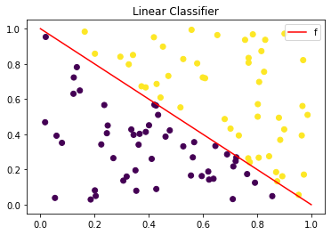
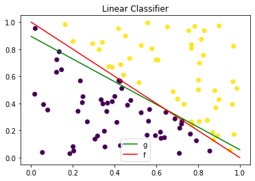

# Hello, Tensorflow

Tensorflow是广泛使用的实现机器学习以及其它涉及大量数学运算的算法库之一。Tensorflow由Google开发，是GitHub上最受欢迎的机器学习库之一。Google几乎在所有应用程序中都使用Tensorflow来实现机器学习。 例如，如果您使用到了Google照片或Google语音搜索，那么您就间接使用了Tensorflow模型。它们在大型Google硬件集群上工作，在感知任务方面功能强大。

Tensowflow内部有自己定义的常量、变量、数据操作等要素，它使用图(Graph)来表示计算任务，使用会话(Session)来执行图。TensorFlow的核心组件是通过边遍历所有节点的计算图和张量。

## 使用Tensorflow输出一句话


```python
import tensorflow as tf
import numpy as np
```


```python
# 初始化 tf 中的常量， 并命名为greeting作为一个计算模块。
tf.compat.v1.disable_eager_execution()  # 保证sess.run()能够正常运行
greeting = tf.constant('Hello Google Tensorflow!')
```


```python
# tensorflow2删除了tf.Session()

# Using the `close()` method.
sess = tf.compat.v1.Session()
print("method1:\n", sess.run(greeting))
sess.close()
 
# Using the context manager.
with tf.compat.v1.Session() as sess:
    print("method2:\n", sess.run(greeting))

```

    method1:
     b'Hello Google Tensorflow!'
    method2:
     b'Hello Google Tensorflow!'
    

## 使用tensorflow自定义线性分类器


```python
# 生成线性二分类数据
def make_point(point_number, dim, scale):
    """
    生成分类点
    :param point_number: 点的数目（int)
    :param dim: 点的维数(int)
    :param scale: 点的范围(int)
    :return:
    """
    np.random.seed(33)
    X = np.random.random([point_number, dim]) * scale # (size, range)
    Y = np.zeros(point_number)
    sum_X = np.sum(X, axis=1)
    for i in range(point_number):
        if sum_X[i] - scale < 0:  # x + y - 1 = 0
            Y[i] = -1
        else:
            Y[i] = 1
    return X, Y
```


```python
%matplotlib inline
import matplotlib.pyplot as plt

X, Y = make_point(100, 2, 1)

plt.scatter(X.T[0], X.T[1], c=Y)
x_f = np.linspace(0, 1, 100)
y_f = -1*x_f + 1
plt.plot(x_f, y_f, c='red', label='f')        # 绘制f函数
plt.legend()
plt.title("Linear Classifier")
plt.show()
```


    

    


```python
from sklearn.model_selection import train_test_split
X_train, X_test, y_train, y_test = train_test_split(X, Y, random_state=33, test_size=0.1)
```


```python
# 定义b为截距
b = tf.Variable(tf.zeros([1]))
# 定义W为线性模型的系数
W = tf.Variable(tf.random.uniform((1,2), minval=-1.0, maxval=1.0, seed=33))

# 显式定义函数
y = tf.matmul(W, X_train.T) + b

# 误差函数MSE
loss = tf.reduce_mean(tf.square(y - y_train))

# 梯度下降 SGD
optimizer = tf.compat.v1.train.GradientDescentOptimizer(learning_rate=0.01)

# 以最小二乘损失为优化目标
train = optimizer.minimize(loss)
```


```python
# 初始化变量
init = tf.compat.v1.initialize_all_variables()

with tf.compat.v1.Session() as sess:
    sess.run(init)
    for step in range(0, 1000):
        sess.run(train)
        if step % 50 == 0:
            print("step:{}, W:{}, b:{}".format(step, sess.run(W), sess.run(b)))
    print("step:{}, W:{}, b:{}".format(step, sess.run(W), sess.run(b)))

    W_np = sess.run(W)
    b_np = sess.run(b)
```

    step:0, W:[[-0.8801481  -0.33523023]], b:[0.01241295]
    step:50, W:[[-0.55414635 -0.05988245]], b:[0.26665485]
    step:100, W:[[-0.39772376  0.07031655]], b:[0.2355961]
    step:150, W:[[-0.28075767  0.16661306]], b:[0.14803489]
    step:200, W:[[-0.17564785  0.2526286 ]], b:[0.05207584]
    step:250, W:[[-0.07642704  0.33349276]], b:[-0.04228652]
    step:300, W:[[0.01830273 0.41042697]], b:[-0.13309048]
    step:350, W:[[0.1089702 0.4838215]], b:[-0.22006242]
    step:400, W:[[0.19579437 0.5538849 ]], b:[-0.30327865]
    step:450, W:[[0.27894497 0.620781  ]], b:[-0.38288358]
    step:500, W:[[0.3585763 0.684659 ]], b:[-0.4590304]
    step:550, W:[[0.4348348 0.7456582]], b:[-0.5318684]
    step:600, W:[[0.50786066 0.8039124 ]], b:[-0.6015416]
    step:650, W:[[0.5777885  0.85954773]], b:[-0.6681874]
    step:700, W:[[0.64474714 0.9126851 ]], b:[-0.7319377]
    step:750, W:[[0.7088606 0.9634388]], b:[-0.79291815]
    step:800, W:[[0.7702476 1.0119184]], b:[-0.85124934]
    step:850, W:[[0.8290226 1.0582279]], b:[-0.90704656]
    step:900, W:[[0.885295  1.1024668]], b:[-0.9604197]
    step:950, W:[[0.9391697 1.1447296]], b:[-1.0114747]
    step:999, W:[[0.98973745 1.1843163 ]], b:[-1.0593562]
    


```python
%matplotlib inline
x_g = np.linspace(0, 1, 100)
y_g = (-W_np[0][0]*x_g - b_np)/W_np[0][1]

plt.plot(x_g, y_g, c='green', label='g')

plt.scatter(X.T[0], X.T[1], c=Y)
x_f = np.linspace(0, 1, 100)
y_f = -1*x_f + 1
plt.plot(x_f, y_f, c='red', label='f')        # 绘制f函数
plt.legend()
plt.title("Linear Classifier")
plt.show()
```


    

    

